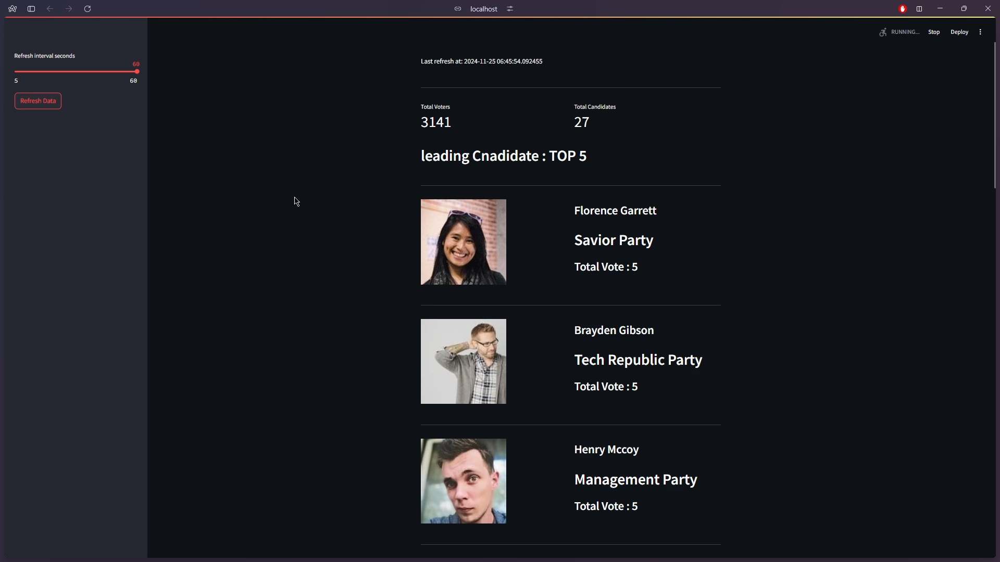
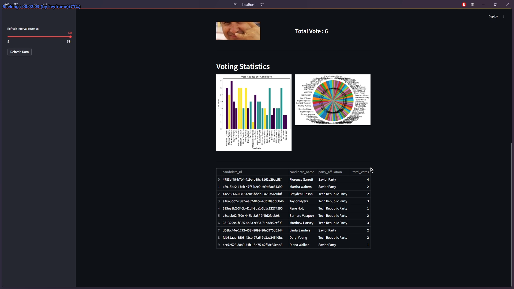

# Realtime Election Voting System

This repository contains the code for a real-time election voting system designed to process and analyze voting data in a streaming manner. The system uses Python for data processing, Apache Kafka for message management, and Spark Streaming for real-time data processing. Voting data is stored in a PostgreSQL database, and results are visualized through Streamlit. By leveraging Docker Compose, the system easily spins up the necessary services (Kafka, Spark, PostgreSQL, and Streamlit) within Docker containers, enabling quick testing and development. The goal of this project is to provide a scalable and efficient solution for processing election voting data in real-time.

# System Components

main.py: This is the primary Python script responsible for initializing the application. It creates the necessary tables in the PostgreSQL database, including those for candidates, voters, and votes. Additionally, it sets up the Kafka topic and replicates the votes table within this topic. The script also contains the logic to consume votes from the Kafka topic and produce data to the voters_topic, facilitating the flow of information between the voting process and the database.

voting.py: This script handles the core voting logic by consuming votes from the voters_topic Kafka topic. It generates voting data based on incoming voter inputs and publishes the resulting data to the votes_topic on Kafka. This enables real-time processing and distribution of votes as they are cast.

spark-streaming.ipynb: This Python Notebook is designed to process the votes in real time. It consumes data from the votes_topic Kafka topic, enriches the voting data by integrating it with information from the PostgreSQL database, and aggregates the votes. The enriched and aggregated data is then produced to specific topics on Kafka, ensuring that the information is readily available for further analysis.

streamlit-app.py: This script implements the user interface for the voting system using Streamlit. It consumes the aggregated voting data from both the Kafka topic and the PostgreSQL database, displaying the voting results in real time. This interactive application allows users to visualize voting trends and outcomes as they happen, providing an engaging and informative experience.

# Screenshots

<!-- 

  <kbd>
    
    
    
  </kbd>

 -->

## Dashboard UI

<!-- 

  <kbd>
    
    
    
  </kbd>

 -->